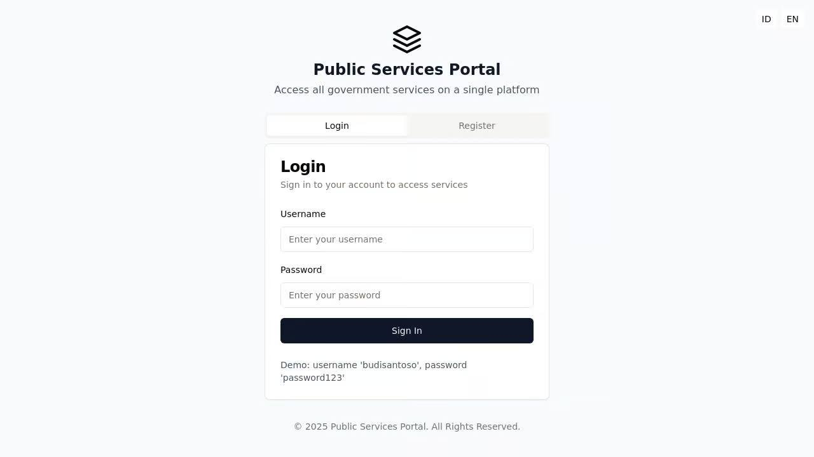

# Public Services Portal (Portal Layanan Publik)

A centralized digital platform for accessing various government public services with a focus on user-friendly interface and service request functionality.




## Overview

The Public Services Portal is a web application designed to provide citizens with a single platform to access various government services. The application serves as a bridge between citizens and government agencies, streamlining the process of applying for and tracking public services.

Built with modern web technologies, this platform enables users to:
- Discover available government services across different categories
- Submit applications for various services
- Track application status in real-time
- Receive notifications about application updates
- Manage personal profile information

## Features

### Multi-language Support
- Fully supports both English and Indonesian (Bahasa Indonesia)
- Easy language switching from any page

### User Authentication
- Secure login system with session management
- Registration for new users
- Profile management with personal information

### Service Discovery
- Browse services by categories
- Featured and popular services highlight
- Search functionality
- Detailed service information pages

### Application Management
- Step-by-step application submission process
- Document upload capability
- Real-time application status tracking
- Application history and records

### Notification System
- Real-time notifications for application updates
- Unread notifications counter
- Notification center with mark-as-read functionality

### Responsive Design
- Works seamlessly on mobile devices, tablets, and desktops
- Dedicated mobile navigation and desktop layout

## Technical Stack

### Frontend
- React.js
- TypeScript
- TanStack Query for data fetching
- React Hook Form for form handling
- Tailwind CSS for styling
- Shadcn UI components
- i18next for internationalization

### Backend
- Node.js with Express
- In-memory storage for development (can be extended to use PostgreSQL)
- RESTful API design

## Getting Started

### Prerequisites
- Node.js (v16 or higher)
- npm (v7 or higher)

### Installation

1. Clone the repository:
```bash
git clone https://github.com/yourusername/public-services-portal.git
cd public-services-portal
```

2. Install dependencies:
```bash
npm install
```

3. Start the development server:
```bash
npm run dev
```

4. Open your browser and navigate to `http://localhost:5000`

## Development

### Project Structure
- `/client` - Frontend React application
  - `/src/components` - Reusable UI components
  - `/src/contexts` - React context providers
  - `/src/hooks` - Custom React hooks
  - `/src/layouts` - Page layout components
  - `/src/lib` - Utility functions
  - `/src/locales` - Translation files
  - `/src/pages` - Page components
- `/server` - Backend Express application
  - `index.ts` - Server entry point
  - `routes.ts` - API route definitions
  - `storage.ts` - Data storage interface
- `/shared` - Shared code between frontend and backend
  - `schema.ts` - Data models and types

### Available Scripts
- `npm run dev` - Starts both frontend and backend development servers
- `npm run build` - Builds the project for production
- `npm run start` - Starts the production server

## Demo Credentials

For demonstration purposes, you can use the following credentials:
- Username: `budisantoso`
- Password: `password123`

## Contributing

Contributions are welcome! Please feel free to submit a Pull Request.

## License

This project is licensed under the MIT License - see the LICENSE file for details.

## Acknowledgments

- Shadcn UI for the component library
- TanStack Query for data fetching
- React Hook Form for form management
- Tailwind CSS for styling